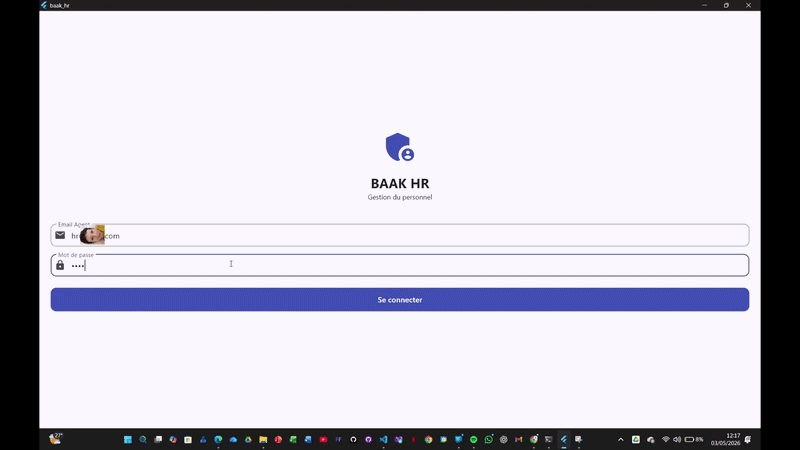

# Baak HR

Baak HR est une solution de gestion des ressources humaines conçue pour offrir une expérience fluide et performante sur les systèmes de bureau.

## Présentation du projet
Ce dépôt contient le code source de l'application Baak HR. Le projet est actuellement en phase de test (Beta) pour valider l'architecture multiplateforme utilisant Flutter.

## Versions de démonstration
Les exécutables pré-compilés pour Windows, Linux et macOS sont disponibles dans la section Releases de ce dépôt. 

Veuillez noter que ces versions sont destinées à des tests internes. Pour fonctionner, l'application nécessite un fichier de configuration privé qui n'est pas inclus dans le code source public afin de protéger l'intégrité des données et des accès API.

> Pour obtenir ce fichier, veuillez contacter [Fordi Malanda](https://github.com/fordimalanda).

## Installation et Test
1. Téléchargez l'archive correspondant à votre système d'exploitation depuis la dernière [Release](https://github.com/lumaka-engineering/test-baak-hr/releases).
2. Extrayez les fichiers dans un dossier local.
3. Pour l'activation de la démo, veuillez contacter Pour obtenir ce fichier, veuillez contacter [Fordi Malanda](https://github.com/fordimalanda).
 afin d'obtenir les paramètres de configuration nécessaires.

## Technologies utilisées
* Framework : Flutter
* Langage : Dart
* Systèmes cibles : Windows, Linux, macOS

## Aperçu de l'interface
